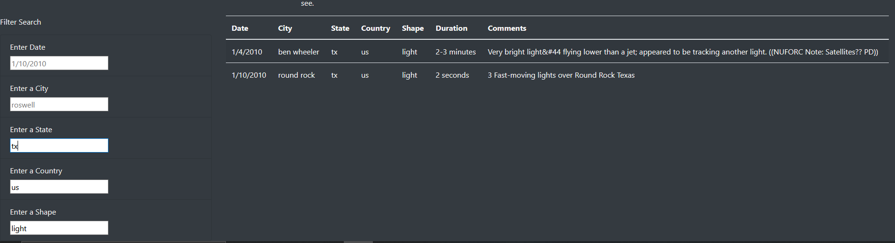

# UFOs
## Purpose

  The purpose of this exercise was utilize Javascript and bootstrap components to make a dynamic website.
The website would take in UFO data from the data.js file and be filtered on the website using app.js along with the html file. Using the filter fields on the site it would be able to return a filtered table based on the entered fields.
## Results
  
  Using the index.html file path in your browser, it would load the website and entire table data would be present below the article paragraph. On the left of table you would see the filter search fields with various fields by which to filter and their placeholders showing the format by which you could filter the table. Upon typing your desired filter in any and all given fields you would proceed by pressing enter once and the table will generate to the right of the filter search. To reset the field you could simply erase the filter or by pressing the "UFO Sightings" link at the top left of the site.
#### Example search

*note that the search can be completed with theother fields not completed.

## Summary
  Upon using the website one drawback that could be brought up is that the filter search table isn't very clear how to begin a filter of the table with the filter button removed. One could make the case to introduce a button below the filter search fields to better demonstate the usage of the filter mechanic.
I would also recommend bringing in more data to search through seeing as a majority of the table results return data from inside the US. Another note would be to possibly add more articles on UFOs and their sources to better inform visitors to the site.
